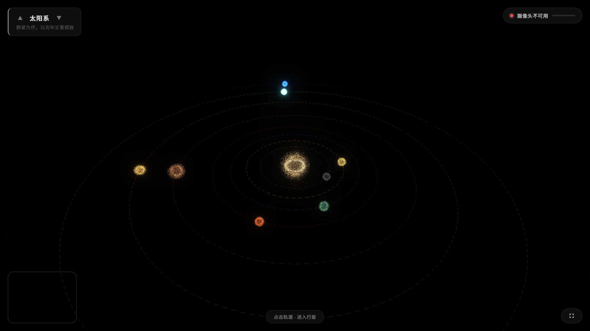
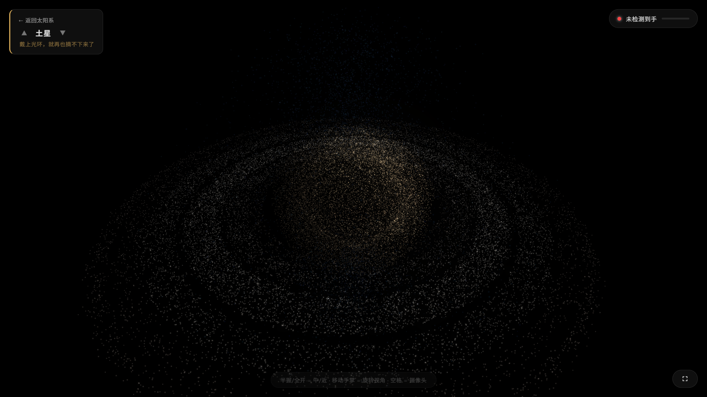

# Solar System Touch

使用 claude code 结合 mimov2.5pro 生成的基于粒子系统的太阳系三维可视化，支持手势操控。

## 功能特性

- **粒子渲染** — 行星、星环、大气层、卫星全部使用自定义 GLSL 着色器的粒子系统
- **9 大天体** — 太阳、水星、金星、地球（含月球）、火星、木星、土星（含星环）、天王星（含星环）、海王星
- **手势操控** — 通过摄像头识别手部动作，实现视角旋转、缩放、行星切换
- **双视角模式**
  - **总览模式** — 太阳系全景，行星沿轨道运行，虚线轨道标注
  - **聚焦模式** — 单颗行星特写，展示粒子细节与大气效果
- **后处理** — Unreal Bloom 泛光 + ACES Filmic 色调映射
- **键盘快捷键** — `F` 全屏，`空格` 切换摄像头画面，`上/下箭头` 切换行星，`Esc` 返回总览

## 手势说明

| 手势 | 操作 |
|------|------|
| 左右移动手掌 | 旋转行星视角 |
| 拇指与食指靠近（捏合） | 缩小至中等视距 |
| 拇指与食指远离（张开） | 放大至近景 |
| 手掌从画面顶部离开 | 切换到上一颗行星 |
| 手掌从画面底部离开 | 切换到下一颗行星 |

## 使用方法

用现代浏览器直接打开 `index_backup.html`（推荐 Chrome 以获得 MediaPipe 支持）。无需构建，
